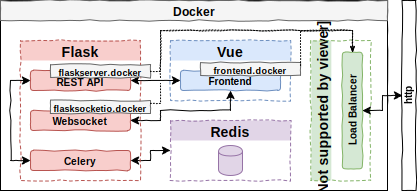
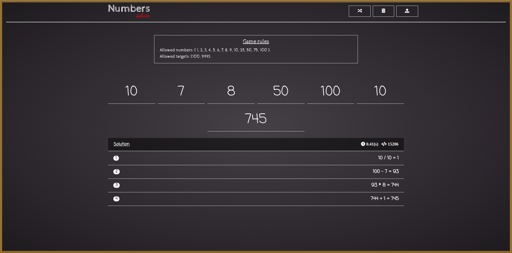
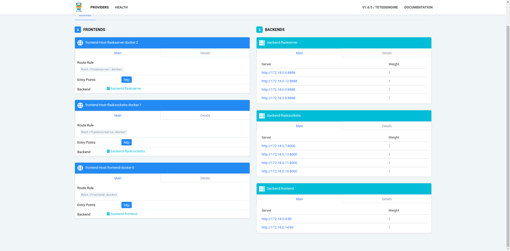

# vue-flask-celery-docker
Dockerized client-server application of Letters &amp; Numbers Game using Flask, Websockets, Celery and Vue. 

# Stack
- **Vagrant & Ansible** for cloud deployment (on a VirtualBox machine).
- **Flask** to build the REST API (with GEvent to allow async requests).
- **Celery** to delegate the execution of heavy tasks, with redis backend (solution of numbers part).
- **Flask-SocketIO** to notify the client ASAP of the solution with no polling (with GEvent to allow async requests).
- **Vue** to build the frontend (with Vue-Router, Vuex, Vue-socketio, axios, i18n, etc).
  - Multilanguage support: english and spanish.
- **Docker** to deploy each service on the private cloud.
- **Traeffik** as load balancer of dockerized services.

# Architecture

<p align="center">
  
</p>

The image shows the proposed architecture. The architecture expose several public endopoints:
- `flaskserver.docker` &rarr; This is the main entry point to the REST API.
- `frontend.docker` &rarr; This is the main entry point to the Frontend Web.
- `flasksocketio.docker` &rarr; This is the main entry point to the websocket subsystem.
- `192.168.33.20:8080` &rarr; This is the entry point to the Traeffik Dashboard, where you can see which services have been deployed.

Besides these endpoints, there are other private endpoints that are not accessible from outside the docker's internal network, like redis or celery.

# Installation
Before installing it, it is required to have installed vagrant and ansible:
- `Vagrant >= 2.0.1`
- `Ansible >= 2.6.2`

Once installed, clone this repository and go to the deploy directory and type the following command on a terminal:
```bash
/deploy$ vagrant up
```
Wait a few minutes and that's it! You'll have the whole application deployed and ready to use!

# Configuration and Usage
Endpoints exposed by traeffik require a domain name, so the IP address of the machine will not be valid. To do this, edit the `/etc/hosts` file and add the following line:
```bash
- 192.168.33.20 flaskserver.docker frontend.docker flasksocketio.docker
```
Once you have configured hosts, open Firefox or Chrome/Chromium browser and type on a tab/window: `http://frontend.docker`. If all went well, you should see the following image:

<p align="center">
  
</p>

Thus, if you press the *numbers* button, you will be redirected to this view:

<p align="center">
  
</p>

In this view, you can input numbers to search for the target number and send the request to the server, which will respond in one of the following ways:
- If websocket service is **on**, then will send a json message through websockets to the client.
- If websocket service is **off**, then the client will request to the server the result through http (only one request, no polling).

## Scaling services
One of the advantages of deploying the services in docker, is the ease with which we can scale them. To do this, enter the following commands on a terminal: 

```bash
/deploy$ vagrant ssh # enter to virtual machine (this command is executed in host machine)
ubuntu@numbersDeploy:~$  cd /opt
ubuntu@numbersDeploy:~$ sudo docker-compose up -d --scale flaskserver=4 --scale frontend=2 --scale socketio=4 # we are scaling the api rest server 4 times, nginx server (frontend) 2 times, and socketio server 4 times in a round-robin fashion.
```
If you go to `192.168.33.20:8080` and see the Traeffik Dashboard, you will see in the backends part, the 10 new services!

<p align="center">
  
</p>

# TO DO
- Implement *letters* part.
